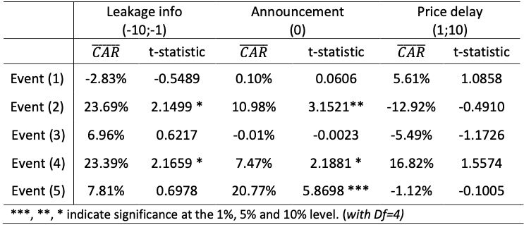
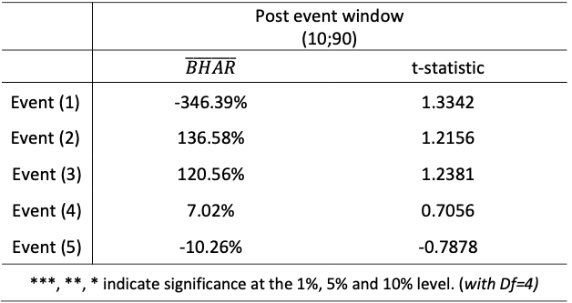
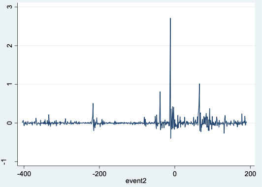

# Coin flipping?
# The impact of @elonmusk on the prices of cryptocurrencies

August 2021

👭 Authors: Trang Ton, Nadine Schulz

This report briefly shows an event study to examine the influence of Elon Musk's tweets on cryptocurrency prices.

Detailed calculation and interpretation:

Source codes: 

### 1. Data 
Closing prices of cryptocurrencies obtained from 01/01/2020 - 21/08/2021:
*  Bitcoin (BTC)
*  Dogecoin (DOGE)
*  Ethereum (ETH)
*  Cardano (ADA)
*  Litecoin (LTC)

*  the crescent cryptocurrency market index (CCMIX) index. 

* 1600 tweets from Elon Musk's Twitter account are collected, with specific filtering for crypto-related tweets including terms like "bitcoin", "dogecoin", and "cryptocurrency" 

### 2. Event study
The study carries out an event study in both short-term and long-term analyses with the help of the cumulative abnormal return approach (CAR) and the buy-and-hold abnormal return approach (BHAR). Both approaches are constructed based on the market model.

The event window is divided into sub-sections, including the event date, leakage information window, and price delay window.

a. Short-term analysis - CAR approach
* The short-term event window: T1 = -10 (days), T2 = 10 (days).

b. Long-term analysis - BHAR approach
* The long-term event window was 3 months after the announcement date of the event.

### 3. Main results 💡

*Table 1: Average CAR and t-statistic*

*Table 2: Average BHAR and t-statistics*

✅ The findings revealed a smaller and less clear influence than initially assumed. 

✅ No significant impact was observed in the post-event window due to the fast-paced nature of cryptocurrencies and frequent tweets by Musk. 

✅ However, two significant tweets (Event 2 & 4 in Table 1) were identified that appeared to influence cryptocurrencies in the short term.

*Figure: AR of Dogecoin at the 2nd event*

The abnormal returns of event two, for example, a deflection of these can also clearly be seen at time zero (see figure above). The same results can be seen for the fourth and fifth events as well.

### 📖 References:
Ante, Lennart (2021): How Elon Musk's Twitter activity moves cryptocurrency markets. BRL Working Paper Series No. 16.

Rui Fan, Oleksandr Talavera, Vu Tran (2018): Does connection with @realDonaldTrump affect stock prices? *,**. Swansea University

Data sources:

https://twitter.com/elonmusk

https://finance.yahoo.com/
